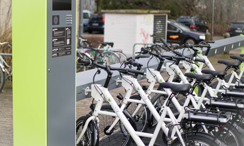



# Bikeman {:class="img-responsive, pull-right" :alt="RWTH Aachen"}
Bikeman is a CMS (abbr.: Central Management System) and implements a protocol.
The protocol is designed to be implemented as a RESTful Webservice with
HTTP as the underlying data transfer protocol. The resources are represented
in JSON data format.
We require that all communications are done encrypted, e.g. using SSL/TLS
or VPN.	
{:class="img-responsive, pull-right" :alt="Bikesharing"}
