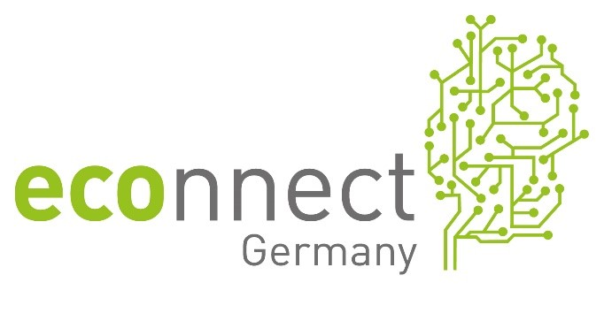

This project is supposed to design sustainable electro mobility.
In order to achieve this, intelligent and sustainable usage of electromoble traffic applications (Smart Traffic) and an integration of electro mobility in an intelligent power supply system (Smart Grid) is required.
Particullarly the infrastructure of power plants has been taken into consideration.

{:class="img-responsive" :alt="{{ page.title }}"}
